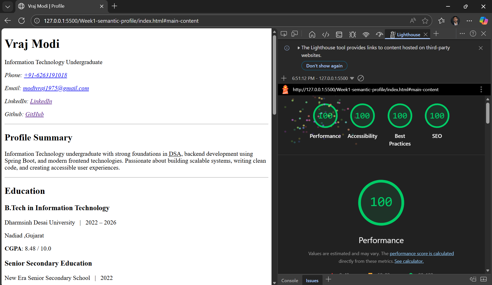

# Week 1 Deliverable – Semantic Profile Page

## 📌 Overview
This project is a semantic and accessible profile page built entirely using **HTML5**.  
The objective of this deliverable is to demonstrate proper usage of semantic HTML elements along with accessibility-friendly structure.

The page represents a professional profile containing education, projects, skills, certifications, and achievements.

---

## 🎯 Objectives Achieved
- Usage of HTML5 semantic elements
- Accessibility-friendly structure
- Structured personal profile layout
- Proper metadata usage
- Contact information with accessible links
- Organized content using sections and articles

---

## 🧱 Semantic Elements Used
The page uses semantic elements to improve readability and accessibility:

- `<header>` for profile introduction
- `<main>` for primary content
- `<section>` for grouped content
- `<article>` for individual entries
- `<footer>` for closing content
- `<address>` for contact information
- `<time>` for dates
- `<abbr>` for abbreviations
- `<cite>` for certifications

---

## ♿ Accessibility Considerations
Accessibility improvements included:

- Proper heading hierarchy
- ARIA labels for sections
- Semantic layout for screen readers
- Accessible phone and email links
- Descriptive metadata
- External links opened safely using `rel="noopener"`

---

## 📂 Project Structure
Week1-semantic-profile/
├── index.html
├── README.md
└── assets/
    └── lighthouse-score.png

## 📊 Lighthouse Report

Lighthouse audit showing performance and accessibility compliance:

