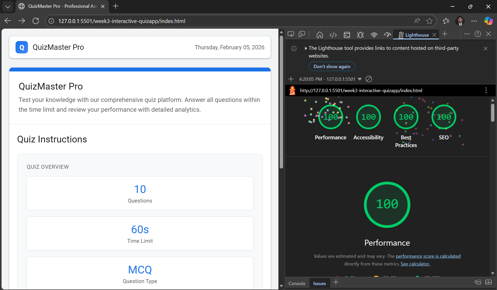

# QuizMaster Pro - Interactive Quiz Application

A professional, feature-rich quiz application built with HTML, CSS, and JavaScript. QuizMaster Pro provides an engaging platform for users to test their knowledge with comprehensive assessment features and detailed performance analytics.

## Overview


QuizMaster Pro is an interactive web-based quiz application designed to deliver a seamless and intuitive user experience. The platform includes multiple screens, real-time progress tracking, and comprehensive analytics to help users understand their performance.

## Features

### 🎯 Core Features
- **10 Multiple Choice Questions** - Comprehensive assessment with MCQ format
- **60-Second Time Limit** - Timed quiz to test knowledge under pressure
- **Question Navigation** - Jump between questions at any time
- **Bookmark System** - Mark important questions for later review
- **Skip Questions** - Ability to skip and return to questions later
- **Visual Progress Tracking** - Real-time progress bar and question status indicators
- **Clear Answer Option** - Remove selected answers and re-attempt questions

### 📊 Analytics & Results
- **Performance Grading** - Automatic grade assignment based on score
- **Detailed Scoring** - 1 point per correct answer, no negative marking
- **Performance Analysis** - Breakdown of strengths and weaknesses
- **Result Statistics** - Cards showing Correct, Incorrect, Skipped answers, and Time Used
- **Answer Review** - Comprehensive review of all answers with detailed explanations

### 🎨 User Experience
- **Intuitive Interface** - Clean, modern design with professional styling
- **Responsive Layout** - Sidebar for navigation and quick statistics
- **Real-Time Timer** - Visual countdown of remaining time
- **Question Navigator** - Visual grid of all questions with status indicators
- **Multiple Screens** - Start screen, quiz screen, results screen, and review screen

## Application Screens

### 1. **Start Screen**
Displays quiz instructions including:
- Quiz overview (10 questions, 60-second limit, MCQ type)
- Available features and capabilities
- Scoring information
- Start Quiz button

### 2. **Quiz Screen**
Active quiz interface featuring:
- Progress container with question count and answered count
- Timer showing remaining time
- Question navigator sidebar for easy navigation
- Current question display with multiple choice options
- Bookmark and control buttons

### 3. **Results Screen**
Post-quiz performance display showing:
- Score circle with percentage
- Performance grade (Excellent, Good, Average, Fair, Poor)
- Personalized performance message
- Statistics cards (Correct, Incorrect, Skipped, Time Used)
- Options to review answers or retake the quiz

### 4. **Review Screen**
Detailed answer review with filters:
- All Questions
- Correct Only
- Incorrect Only
- Skipped Only
- Bookmarked Questions

## Technical Stack

- **HTML5** - Semantic markup structure
- **CSS3** - Professional styling with responsive design
- **JavaScript** - Dynamic functionality and interactivity

## Accessibility & Performance

- Semantic HTML structure with proper landmark elements
- Meta description for SEO optimization
- Accessible color contrast and typography
- Optimized for fast loading and smooth performance
- Lighthouse-optimized for quality assurance

## Getting Started

1. Open `index.html` in your web browser
2. Click "Start Quiz" to begin the assessment
3. Answer questions by selecting options
4. Navigate using the sidebar or Next/Previous buttons
5. Submit your quiz when ready
6. Review your performance and detailed analytics
7. Retake the quiz or review specific answers

## Scoring System

- **Correct Answer**: 1 point
- **Incorrect Answer**: 0 points (no negative marking)
- **Skipped Question**: 0 points

### Grade Mapping
- **90-100**: Excellent
- **75-89**: Good
- **60-74**: Average
- **40-59**: Fair
- **Below 40**: Poor

## Browser Compatibility

Works on all modern browsers including:
- Chrome
- Firefox
- Safari
- Edge

## File Structure

```
week3-interactive-quizapp/
├── index.html          # Main HTML file
├── style.css           # Styling and layout
├── script.js           # JavaScript functionality
├── README.md           # Documentation
└── assets/
    └── lighouse-score.png  # Lighthouse performance screenshot
```

## Features Demonstrated

✅ Responsive web design
✅ Real-time timer implementation
✅ DOM manipulation and event handling
✅ State management with arrays and objects
✅ Dynamic content generation
✅ Performance metrics tracking
✅ Professional UI/UX design
✅ Semantic HTML structure
✅ CSS Grid and Flexbox layouts

## Future Enhancements

- Question randomization
- Multiple quiz categories
- User authentication and profiles
- Leaderboard system
- Difficulty levels
- Timed mode variations
- Export results as PDF
- Dark/Light theme toggle

## 🚀 Getting Started

### Prerequisites
- Any modern web browser (Chrome, Firefox, Safari, Edge)
- No build tools or dependencies required

### Installation
1. Clone or download the project
```bash
git clone https://github.com/vrajmodi2004/Internship-Bootcamp.git
cd week2-landing-page
```

2. Open the project
```bash
open index.html
```


## Author

Created as part of a web development bootcamp project to demonstrate proficiency in frontend technologies and interactive web application development.

---



**Version**: 1.0  
**Last Updated**: February 2026
